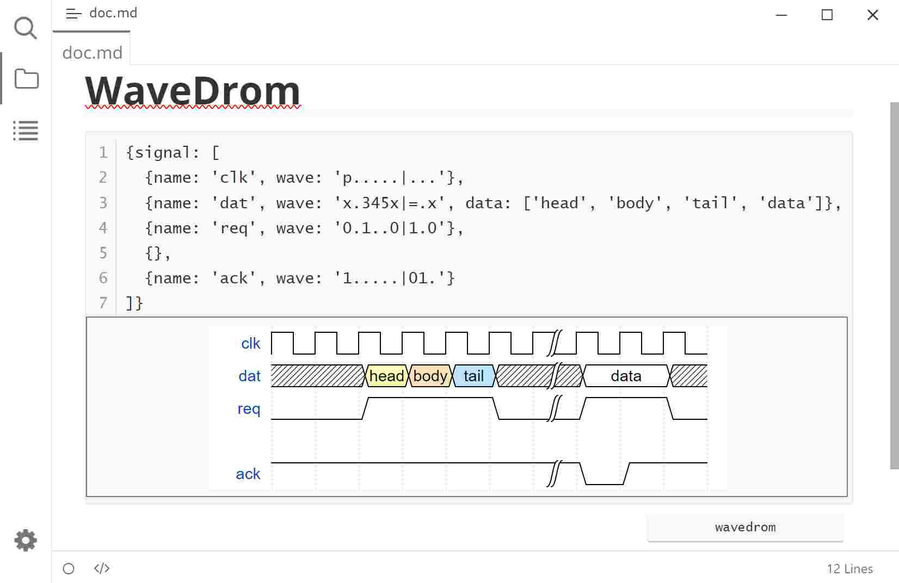

# Typora Plugin WaveDrom

[English](./README.md) | 简体中文

这是一个基于 [typora-community-plugin][core] 开发的，适用于 [Typora](https://typora.io) 的插件。

在 Typora 中使用 [WaveDrom][]：

- [x] `wavedrom` 类型代码块

## 预览

## 安装

1. 安装 [typora-community-plugin][core]
2. 在 “设置 -> 插件市场” 中搜索 “WaveDrom” 并安装

[core]: https://github.com/typora-community-plugin/typora-community-plugin
[WaveDrom]: https://github.com/wavedrom/wavedrom
